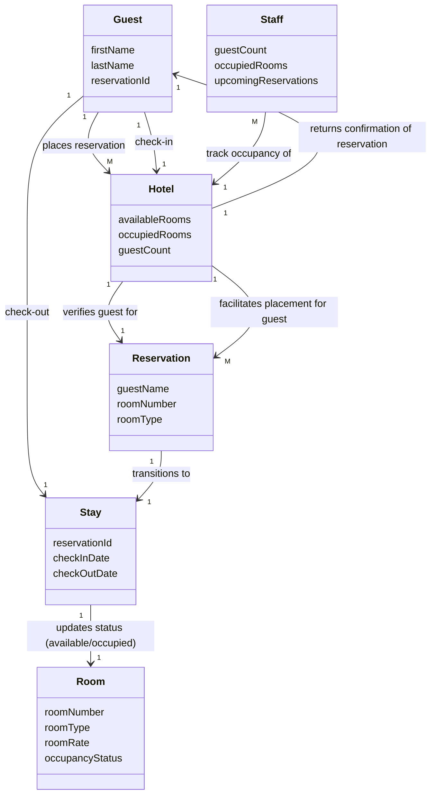
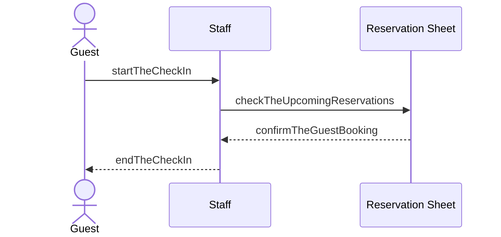

# Assignment 1
### ICS372 | Fall 2026
**Student:** Dini Hassan
**Date:** 9/19/26

# Part 1 - Entity Diagram

|Name|What it is|What it knows|Rationale|
|---|---|---|---|
|Guest|The person(s) who stay at the hotel.|firstName, lastName, reservationID|The guest entity represents the actor in the system responsible for booking reservations.|
|Staff|The person(s) responsible for completing tasks around the hotel.|guestCount, occupiedRooms, upcomingReservations|The staff are the one's managing the hotel's reservation services, representing another primary actor in the system.|
|Reservation|The holding of the room submitted by the guest.|guestName, roomNumber, roomType|The reservation is an item which needs to exist as it is interacted with by the guest, a primary actor in the system.|
|Hotel|The facilitator of bookings and stays, operated by the staff.|availableRooms, occupiedRooms, guestCount|The interface for guests to reserve rooms with the hotel, managing all booking details and returning confirmation of the reservation to the guest.|
|Stay|The active inhabitance of a room by a guest.|reservationId, checkInDate, checkOutDate|The transitioned state from a reserved room to one that is currently occupied. Necessary for staff to know how many people are actively staying in the hotel.|
|Room|The reserved unit by the guest.|roomNumber, roomRate, roomType, occupancyStatus|The reservation and, subsequently, the stay are reliant on a room being available to book and stay in|

# Part 2 - Domain Model Diagram

# Part 3 - Detailed Use Case 

**Actor:** Guest

**Precondition:** The guest placed the reservation and received confirmation from the hotel that the booking was successful, with reservation details included.

**Main flow**

| Actor Action | System Response |
|---|---|
| 1. The actor arrives at the hotel | |
| | 2. The system acknowledges a potential guest.|
| 3. The actor provides evidence of a reservation at the hotel. | |
| | 4. The system looks at the upcoming reservations. |
| | 5. The system verifies the provided reservation details against the ones it has listed. |
| 6. The actor is allowed to check-in and access their reserved room.||

**Alternative flows**

**[A1] At step 3, actor doesn't have reservation details**

| Actor Action | System Response |
|---|---|
| 3a. The actor cannot provide any reservation details. | |
| | 3b. The system disregards the actor as they are not a guest, ending the flow here.|

**[A2] At step 5, the system cannot verify the reservation details**

| Actor Action | System Response |
|---|---|
| | 5a. The system cannot verify the provided details the customer gives. |
|| 5b. The system does not allow the actor to check-in to a hotel room, ending the flow here.|

**Postcondition:** The guest has checked into their reservation, turning the reservation of a room into an active stay.

# Part 4 - Specification and Instance

        Within the domain, the concept of a reservation and a stay appear to be the same at first, denoting the same fact of a user staying in a room at the hotel. However, this is not the case. In the domain model, I have made the conscious choice to connect the two elements, showing them as separate elements and describing the relation as the reservation "transitioning to" a stay.
        In the diagram, the reservation entity exists to mark what the user submitted, a request to hold a room in the hotel for a period between two dates. Once the user arrives and their reservation is confirmed, the reservation, which was the hold on the room, becomes unnecessary as the room's status changes from "open" to "occupied", signaling the reservation has been fulfilled and the stay portion, the active inhabitance of the room, has begun. The two entities exist separate from each other due to that distinction, the reservation as the hold and the stay as the active presence of the guest fulfilling that reservation.
        If the two concepts were to be combined into one element, there would be concerns around how scheduling service and maintenance  fit into the stay lifecycle. With the reservation and stay model, the reservations allow the hotel to coordinate bookings around each other, while stays are used to evaluate the current status of the rooms and whether changes can be made to the room or not. For example, if a room is in need of servicing, the staff must check if the room is occupied or not, which is directly caused by the stay, whereas the reservation is only concerned with if the room has been selected by a guest. Maintenance, in our example, could last for an unspecified amount of time, so the ideal case would be to determine if the room needs any changes before opening the room for booking.

# Part 5 - Sequence Diagram

    In the stage of the design, I was confronted with the reality of needing a system for the staff to confirm bookings. To complete this task, I implemented the reservation sheet. My design as previously constructed did not include this as an entity that would require significant interaction from the domain perspective, but I realize now that the reservations placed by guests would need to be stored or added somewhere to confirm bookings at check-in time. By going through these different stages of the development cycle, I found that I was able to identify new domain elements and incorporate them into the design going forward.