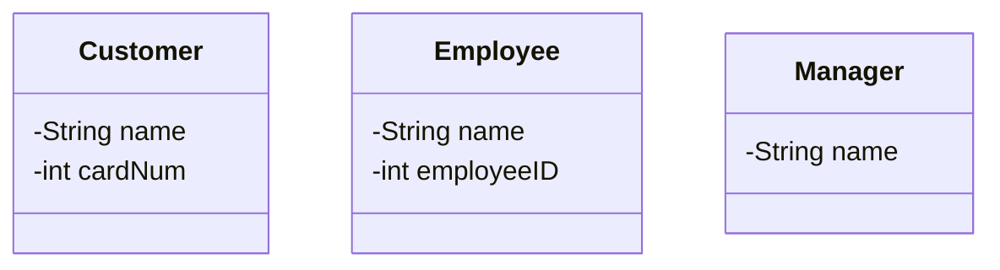

# Individual Sketch — Week 2 Round 1
**Student:** Dini Hassan
**Date:** 9/3/26

---

## My Answer

*Respond directly to the prompt. Write in plain sentences — no need to be formal. You have 12 minutes total, so think first, then write.*

There are, in my opinion, three entities in the program:
 - Customers: Customers objects hold user information, such as name and a payment method. Customer objects can browse the menu and place orders.
 - Employees: Employee objects knows which customer placed which orders. Employee objects can access customer information and mark orders as complete.
 - Managers: Manager objects know what items are in the inventory and manages the menu. They can access menu informaiion and employee infromation.

---

## Diagram

*Include your Mermaid diagram below. If the prompt doesn't ask for a diagram, delete this section.*

---

## What I'm Not Sure About

*One or two sentences. What feels uncertain or wrong about what you just produced?*

The specific relationship between these three entities.

---

**Commit this file before group discussion begins.**
