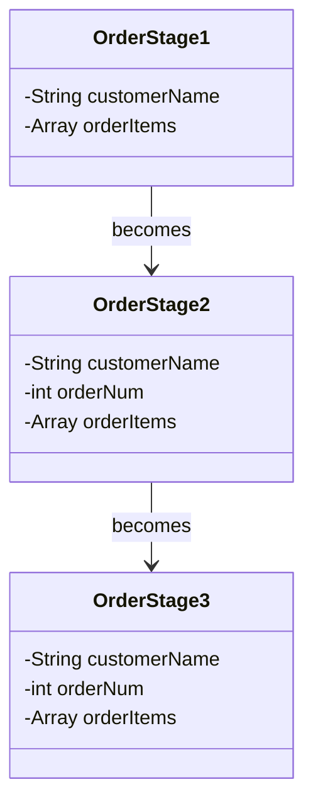

# Individual Sketch — Week 2 Round 2
**Student:** Dini Hassan
**Date:** 9/3/26

---

## My Answer

*Respond directly to the prompt. Write in plain sentences — no need to be formal. You have 12 minutes total, so think first, then write.*

The Order entity exists at three specific points (Customer creation, Customer Submission, andd Employee delivery). Here are the fields and behaviours of an oder at all stages:
- Customer creation: 
    -Fields:
        -String customerName
        -Array orderItems
    -Values:
        -customerName: This variable should hoild the name of the customer preparing the order.
        -orderItems: This array holds the items that the customer is adding from the menu.
- Customer submission:
    -Fields:
        -String customerName
        -int orderNum
        -Array orderItems
    -Values:
        -customerName: This variable should hoild the name of the customer preparing the order.
        -orderNum: The assigned number at the point of submission for the employee to manage a specific customers order.
        -orderItems: This array holds the items that the customer has added from the menu.
- Employee delivery:
    -Fields:
        -String customerName
        -int orderNum
        -Array orderItems
    -Values:
        -customerName: This variable should hoild the name of the customer preparing the order.
        -orderNum: The assigned number at the point of submission for the employee to manage a specific customers order.
        -orderItems: This array holds the items that the customer ordered and is being returned.

---

## Diagram

*Include your Mermaid diagram below. If the prompt doesn't ask for a diagram, delete this section.*

---

## What I'm Not Sure About

*One or two sentences. What feels uncertain or wrong about what you just produced?*

I'm still not certain if there should be any chgnages to the existing properties between stage 2 and 3. For right now, I have them as the same as I don't believe any changes need to occur.

---

**Commit this file before group discussion begins.**
