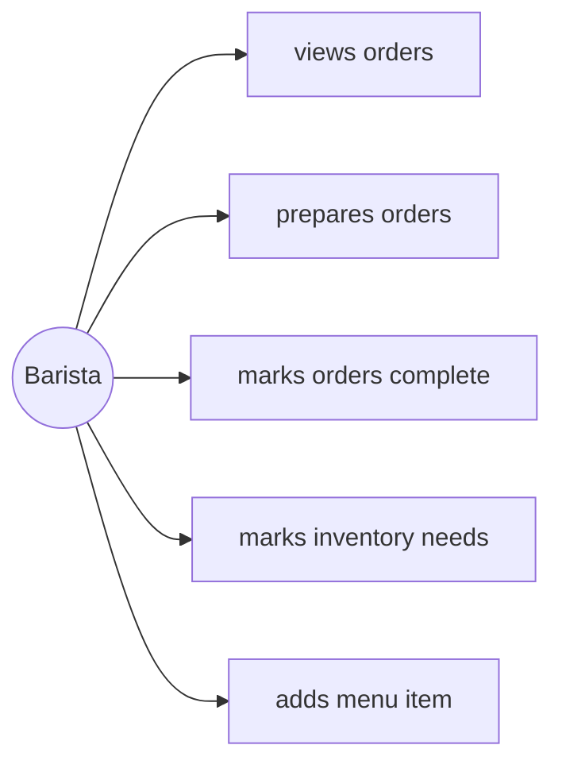

# Individual Sketch — Week 3 Round 2
**Student:** Dini Hassan
**Date:** 9/10/26

---

## My Answer

*Respond directly to the prompt. Write in plain sentences — no need to be formal. You have 12 minutes total, so think first, then write.*

- **[UC-B1] [Barista]** [one line: barista views orders] *[req 3.1]*
- **[UC-B2] [Barista]** [one line: barista prepares orders] *[req 3.2]*
- **[UC-B3] [Barista]** [one line: barista marks orders complete] *[req 3.3]*
- **[UC-B6] [Barista]** [one line: barista marks inventory needs] *[req 3.6]*
- **[UC-B7] [Barista]** [one line: barista adds menu item] *[req 3.7]*

I believe that there are only three actors as there aren't any other responsibilities/actions left as described by the owner to attribute to another actor in the system.

---

## Diagram

*Include your Mermaid diagram below. If the prompt doesn't ask for a diagram, delete this section.*

---

## What I'm Not Sure About

*One or two sentences. What feels uncertain or wrong about what you just produced?*

I'm unsure how some opf the functional ones we lsited as a group ended up not being able to be converted into use cases. Also, I'm still a bit unsure about what counts as a use case.

---

**Commit this file before group discussion begins.**
