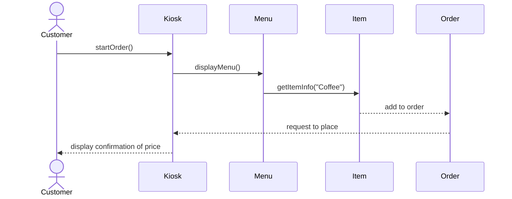
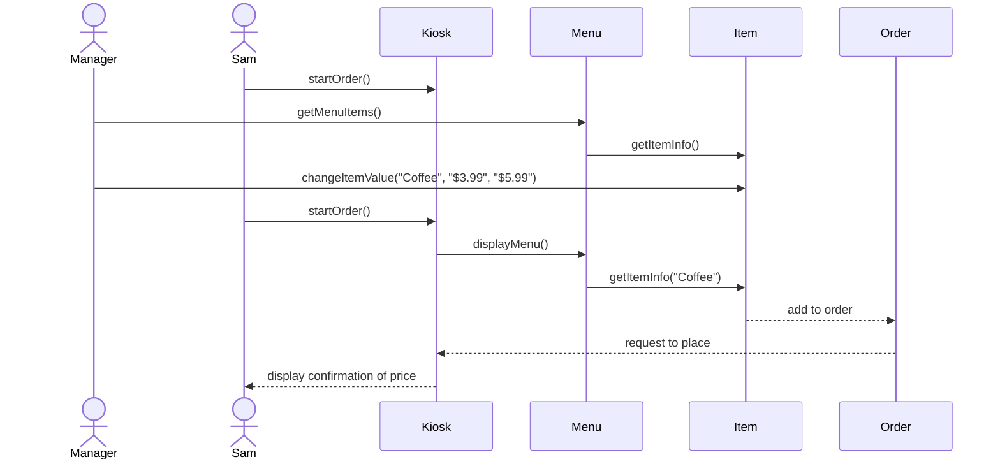

# Individual Sketch ��� Week 4 Round 2
**Student:** Dini Hassan    
**Date:** 9/17/26

---

## 1. Tonight's Prompt

1. Draw Customer Places Order as a sequence diagram in Mermaid, working from the numbered steps of the use case you wrote last week. The actor, at least three entities named exactly as your model names them, every arrow labelled with the message in plain language — askForCurrentPrice, not getPrice() — and the return path, not just the outgoing calls.

2. Then draw the price change. Two short diagrams or one, your choice: the manager changing the price, and Sam's order being totalled. Follow the arrow that reads the price and say exactly which object it lands on.

3. State what your model says Sam paid, honestly. If it charges him five dollars, write that down. If you cannot tell, write that down — being unable to tell is itself the answer.

In selecting the coffee model after the price changes, Sam paid the update price of $5.99 for coffee.

---

## 2. What I'm Not Sure About

If my structure for the diagram is descriptive enough for someone who is not familiar with the domain to understand the graph I made.

---

**Commit this file before group discussion begins.**

    

